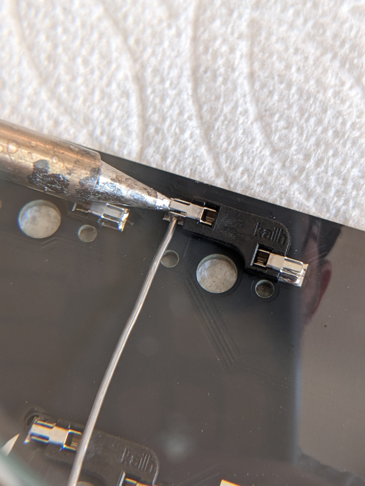

# Build Guide

This guide is for assembling the bare-bones kit

## Parts
| Name                   | Qty | Notes |
| ---------              | --- | ----- |
| Adelheid XT PCB        | 1   |
| FR4 switch plate 1.2mm | 1   |
| FR4 bottom plate 1.6mm | 1   |
| Blackpill (STM32F411)  | 1   |
| SSD1306 128x32 OLED    | 1   |
| EC11 rotary encoder    | 1   |
| M2x5mm spacer          | 11  | [Amazon](https://www.amazon.com/gp/product/B00R1ISEW0/)
| M2x4mm screw           | 22  | [Amazon](https://www.amazon.com/gp/product/B082XXWTXJ/)
| Key switches           | 119 - 225 |
| 2u stabalizers         | 5 - 10    |
| OLED header (1x4)      | 1   | [Link](https://www.mouser.com/ProductDetail/517-929850-01-04-RA)
| Mill-Max 315 socket (1x20) | 2   | [Link](https://www.mouser.com/ProductDetail/Mill-Max/315-93-120-41-001000?qs=sGAEpiMZZMvlX3nhDDO4AF3r3Xqn7mCj9OyqbTK4Na8%3D)
| Mill-Max 315 socket (1x4) | 1   | [Link](https://www.mouser.com/ProductDetail/Mill-Max/315-13-104-41-003000?qs=sGAEpiMZZMvlX3nhDDO4ADjGXzRyAu%252BaiNAsvte6tSs%3D)
| Mill-Max round pin (6.35mm) | 44   | [Link](https://www.mouser.com/ProductDetail/575-3320000150000030)
| Kailh hot swap socket  | 119 - 225 | [Link](https://www.aliexpress.com/item/2255800865526224.html?spm=a2g0o.order_list.0.0.71e51802oef56x&gatewayAdapt=4itemAdapt)
| BAV70 SMD diode        | 64  | [Link](https://www.digikey.com/en/products/detail/onsemi/BAV70LT3G/1475508)
| Rubber bumper          | 4 - 6 | [Amazon](https://www.amazon.com/gp/product/B088T7XMCY/)
| Aluminum case feet     | 2   | [Link](https://www.aliexpress.com/item/3256802898681398.html?spm=a2g0o.order_list.0.0.71e51802oef56x)

## Optional Parts
* Blue Loctite [Amazon](https://www.amazon.com/gp/product/B000I1RSNS/)
* Keyboard plate support fork (search on Etsy)
* Electrical tape
* White 2mm switch LED
* 470Ω through hole resistor
* Wire

## Ordering PCBs
### `pcb-gerbers.zip`
- No special parameters

### `plate-gerbers.zip`
- Specify 1.2mm thickness
- Specify that there are no holes to drill ("no drills")
- If review fails for a a missing solder mask, specify to cover whole layer

### `bottom-gerbers.zip`
- No special parameters

## Instructions

### Solder all BAV70 diodes to the PCB (D0 - D63)
#### Pre-tin a single pad
Below are before and after pictures of a solder pad before and after pre-tinning a single pad for D0

#### Solder down the single leg to the pre-tinned pad
Position the diode using a pair of tweesers, and solder the leg to the pre-tinned pad. See [this image](images/grip.jpg) for additional reference.

#### Solder remaining legs to their pads

### Solder Kaailh hot swap sockets
Similar to how the diodes are soldered, pre-tin a pad.

Place the socket in place and apply heat with a soldering iron so it heats both the tab on the socket and the pad. Take care that you've positioned the socket in the correct orintation so it does not block the center hole (see [this image for an improperly positioned socket](images/sockets/bad_position.jpg)).

Using a soldering iron, apply heat and solder to the other tab of the socket. Take care not to add too much solder as it may flow into the part of the socket meant to recieve the leg of the key switch (see [this image and note that the void in the tab is full of solder and the solder has begun to flow on top of the tab](images/sockets/full.jpg), indicating that the solder is about to flow into the switch socket).

Note that in the image above, the soldering iron is about to come in contact with the socket to the left, which would cause it to melt. To avoid this, solder the sockets into place by collumn, working from the right side to the left.

### Solder Mill-Max headers for Blackpill.  (Plastic headers on the back while pins are soldered from the front)
### Place masking tape over headers and push all 44 Mill-Max pins into place with tweezers.
### Position Blackpill over the headers/masking tape with the pins protruding though the holes.  Solder into place.
### Slowly remove Blackpill, being careful not to bend any pins.  Remove the masking tape push the Blackpill back in place.
### Solder OLED header into place.  Plastic header will be on the front, and pins will be soldered in from the back.
### Solder EC11 rotary encoder.  Encoder is on the front, while pins are soldered from the back.
### Install 2u stabalizers.
### Place M2x5 spacers on the bottom of the board over the mounting holes and secure them tightly with M2x4mm screws.  Recommend using blue Loctite on the screws to prevent them from loosening.  They will be hard to retighten once the plate/switches are installed.
### Push a switch in each corner of the switch plate, and push them into place onto the PCB.
### Push the rest of the switches in one column at a time, starting from the left column.  This is where a plate support fork will come in handy.
### Optional - LED for light-up star.  Hand solder wire + 470 resistor + LED to the 3.3v (long pin) and GND (short pin).  Resistor can go anywhere in the circuit.  Wrap exposed wire/pins with electrical tape and tape into place.  [See this image for LED placement](https://imgur.com/45BqOUW).
### Screw aluminum case feet to the bottom plate (2 large holes).  Or you can just use 2 extra rubber bumpers instead if you want a case with no typing angle.
### Attach 4 rubber bumpers to the lower edge of the bottom plate.  [See image for palcement](https://imgur.com/AwumD0c)
### Secure bottom plate to spacers with the remaining M2x4mm screws.
### Insert OLED screen into the header on top of board.